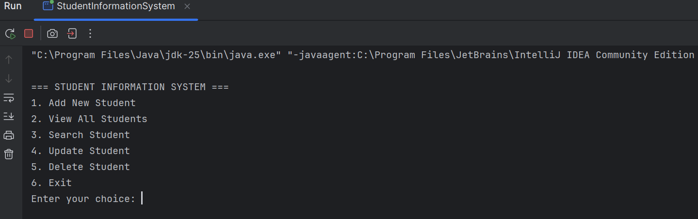
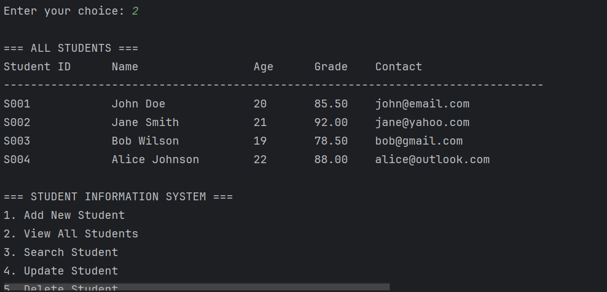

# Student Information System - Documentation

## 📖 Project Overview and Objectives
The **Student Information System (SIS)** is a Java-based application designed to manage student records.  
It allows users to add, view, search, update, and delete student details through a menu-driven interface.

**Objectives:**
- Practice object-oriented programming in Java.
- Implement data validation for user inputs.
- Provide a simple, user-friendly interface using Scanner.
- Deliver complete documentation including installation guide, user manual, and code explanation.

---

## ⚙️ Setup and Installation Instructions
1. Install **Java JDK 8 or higher**.
2. Install **IntelliJ IDEA** (or any Java IDE).
3. Clone or download this repository: https://github.com/rishuaryan/student_information_system
4. Open the project in IntelliJ.
5. Navigate to `src/StudentInformationSystem.java`.
6. Run the program → the menu-driven interface will appear.

---

## 📂 Code Structure Explanation
StudentInformationSystem/ 
├── README.md 
├── src/ │    
         ├── Student.java │    
         ├── ValidationUtils.java │    
         ├── StudentManager.java │    
         └── StudentInformationSystem.java 
├── docs/ │    
          ├── UserManual.md │    
          ├── menu_screenshot.png │     
          ├── add_student.png │    
          └── view_students.png 
└── test_data/ |
               └── sample_students.txt

**File Details:**
- `Student.java` → Defines student attributes: `name`, `age`, `grade`, `studentId`, `contact`.
- `ValidationUtils.java` → Contains helper methods for input validation (age > 0, grade between 0–100).
- `StudentManager.java` → Implements CRUD operations (add, search, update, delete).
- `StudentInformationSystem.java` → Main class with menu-driven interface using Scanner.
- `docs/UserManual.md` → Step-by-step usage guide with screenshots.
- `test_data/sample_students.txt` → Sample student records for testing.

---

## 📘 User Manual
### Running the Program
1. Open IntelliJ IDEA.
2. Run `StudentInformationSystem.java`.
3. The main menu will appear with options.

### Menu Options
- **Add New Student** → Enter ID, name, age, grade, contact.
- **View All Students** → Displays all students in a formatted table.
- **Search Student** → Search by ID or name.
- **Update Student** → Modify details of an existing student.
- **Delete Student** → Remove a student record.
- **Exit** → Close the program.

### Example Flow
1. Add 3 students.
2. View all students.
3. Search for one student by ID.
4. Update their grade.
5. Delete another student.
6. Exit program.

---

## 🖼️ Screenshots
### Main Menu

### Add Student Example

### View All Students

---

## 🧪 Testing
Use the sample data in `test_data/sample_students.txt` to test the system:

S001, John Doe, 20, 85.5, john@email.com
S002, Jane Smith, 21, 92.0, jane@yahoo.com
S003, Bob Wilson, 19, 78.5, bob@gmail.com
S004, Alice Johnson, 22, 88.0, alice@outlook.com

---

## ✅ Technical Requirements Met
- **Student class** → Implemented with attributes: name, age, grade, studentId, contact.
- **Data validation** → Age must be positive, grade must be between 0–100 (ValidationUtils.java).
- **Menu-driven interface** → Implemented in StudentInformationSystem.java using Scanner.
- **CRUD operations** → Add, View, Search, Update, Delete implemented in StudentManager.java.
- **Formatted output** → Students displayed in tabular format.
- **Documentation** → README.md, UserManual.md, and sample test data included.
- **Screenshots** → Added in `docs/` folder to demonstrate working application.

---

## 🏆 Quality Standards Checklist
- Clear project overview ✅
- Step-by-step installation guide ✅
- Code structure explanation ✅
- User manual with screenshots ✅
- Technical requirements checklist ✅
- Sample test data ✅  

